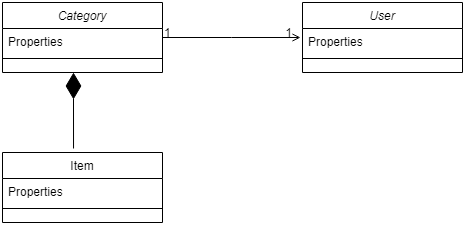
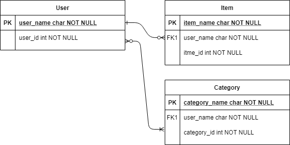
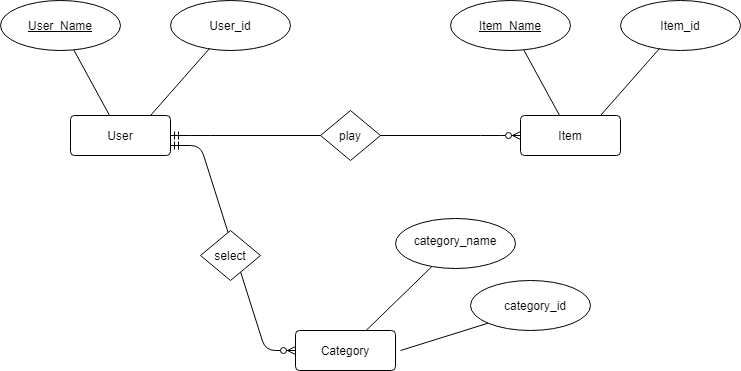
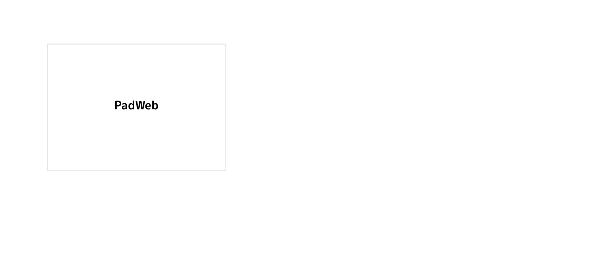
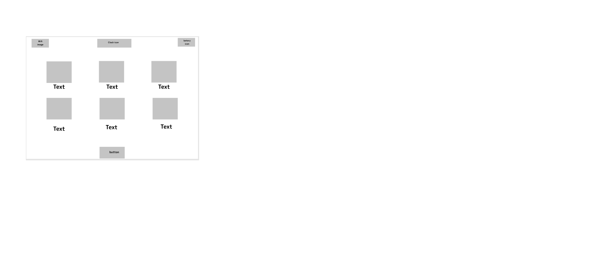
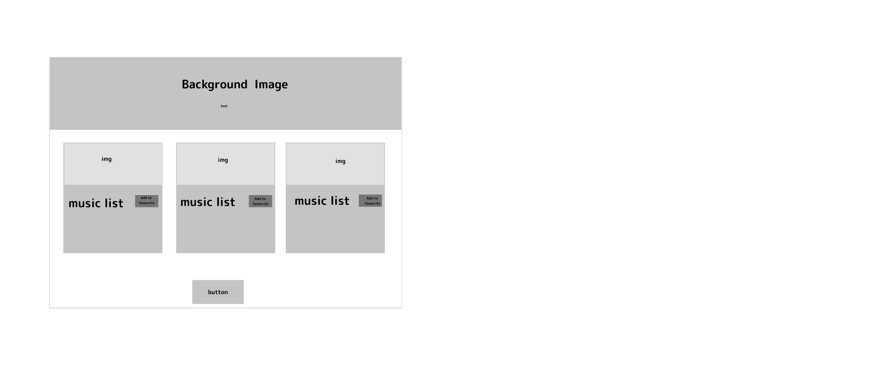
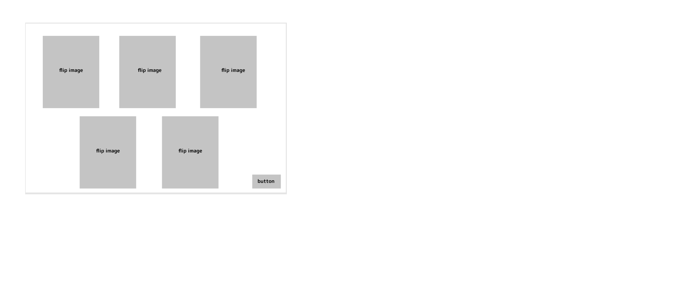

# PadWeb

**Team members**
- Haya shibli

- Joudi awameh

- Batool alomari

- Omar zain

- Abdullah mouazen

**Project Description**

A website that simulate the iPad general look and icons with some functionality in each icon (app). Our project change the usual structure and design of websites as well as it can contain multiple different ideas and websites within it. It's an entertainment website so it will be so helpful to the user because the structure of the website has the flavor of the iPad. The MVP for our project is to make a full website of apps including one app with full functionality.

#  User Stories
1. starter page 
#### as i user i want the wepsite when start have a starter animation with the main name  
- use a starter animation before go to  the main page 

2. main page
#### as a user i would like  to see the main page similar to iPad screen
- put an icone to your page similare to iPad screen and dont forgate the buttery icon 
 
3. music page 
 #### as a user i want when click on music icon go to music page , listen to music and add to favorite
 - creat the music page 
 - add music 
 - dont forget to use local storage 
  
4. page owner
   #### as a user i want to know more about the page owner 
   - creat a page have the information about the page owner
   - and dont foregt have an icone to go throught to the page

5. style and animation 
   #### as a user i want the hole  pages to be Interactive and have a beautiful css
   - use css and the animation to style your page 
   
# Domain model Diagram 

   
   
# Entity Relationship Diagram

   ## Table Diagram 
   
   
   
   ## ER Diagram
   
   
   
    

# wireframe  project :

#### enterance

 

#### main screen

 

#### music app

 

#### ABOUT US

 

# Problem Domain
Most of the websites have the same display and structure which make it some boring and nothing new and some of them is had a complicated navigation or maybe not usual for the user , from this point we decide as team that we will create a new structure, new view and display for our website that is similar to the most thing the the user use which the IPAD we create a similar website for the IPAD.

# 1.0.0 index.html
we 

